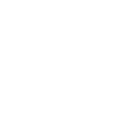

# Brand resources
This repository contains all kinds of brand resources for [owe.zone](https://owe.zone).

## Logo

### [Blue Logo](logo/blue-logo/blue-logo.png)
The blue logo has a white background is intendet for the use on light backgrounds.

[png](logo/blue-logo/blue-logo.png) / [png@2x](logo/blue-logo/blue-logo@2x.png) 
// [32px](logo/blue-logo/blue-logo-64.png) / [64px](logo/blue-logo/blue-logo-64.png) / [120px](logo/blue-logo/blue-logo-120.png) 

[svg](logo/blue-logo/blue-logo.svg) 

### [White Logo](logo/white-logo/white-logo.png)
The white logo has a transparent background is intendet for the use on dark backgrounds.

[png](logo/white-logo/white-logo.png) / [png@2x](logo/white-logo/white-logo@2x.png) 
// [32px](logo/white-logo/white-logo-64.png) / [64px](logo/white-logo/white-logo-64.png) / [120px](logo/white-logo/white-logo-120.png) 

[svg](logo/white-logo/white-logo.svg) 

### [Avatar](logo/avatar/avatar.png)
The avatar is the official social face of [owe.zone](https://owe.zone).

[png](logo/avatar/avatar.png) / [png@2x](logo/avatar/avatar@2x.png) / [png@3x](logo/avatar/avatar@3x.png) / [png-large](logo/avatar/avatar.png)

[jpg](logo/avatar/avatar.jpg) / [jpg@2x](logo/avatar/avatar@2x.jpg) / [jpg@3x](logo/avatar/avatar@3x.jpg) / [jpg-large](logo/avatar/avatar.jpg)

### [Source File](logo/logo.afdesign)
The source .afdesign file contains all versions and predefined export slices for each of them.
